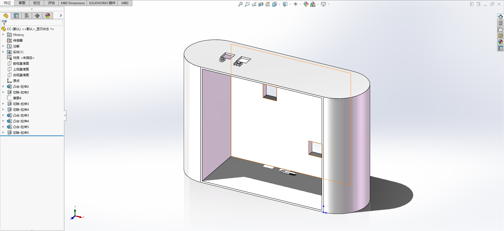
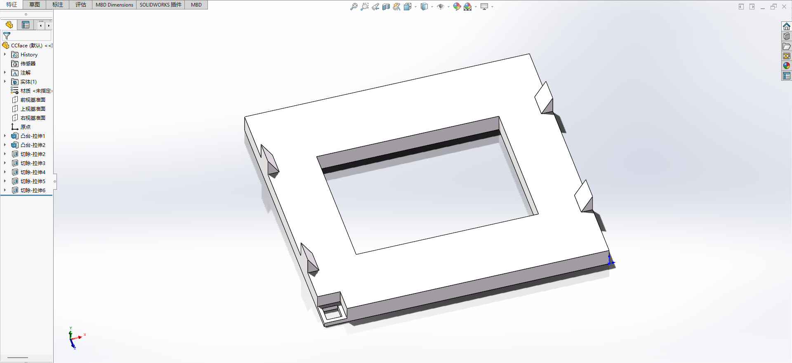
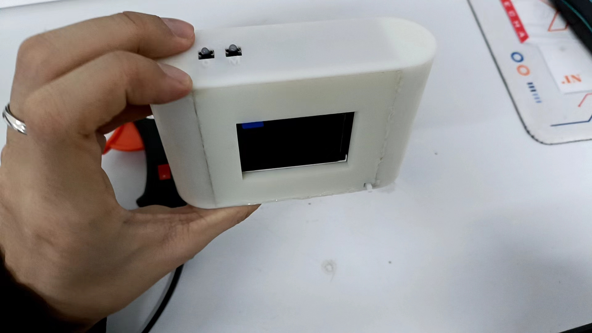
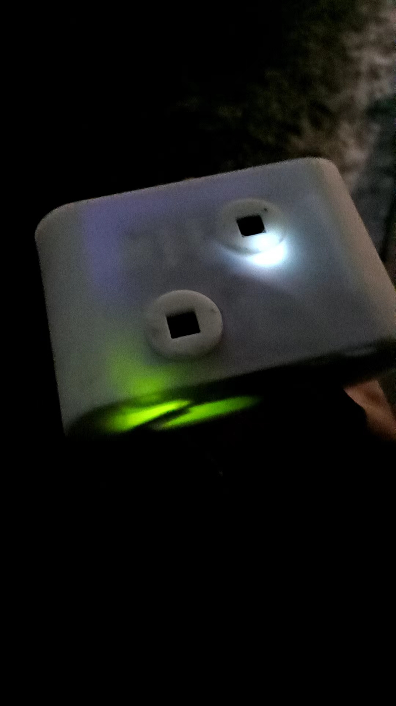

## 产品说明

主控芯片：Stm32H750VBT6

代码构建工具：Stm32CubeMX，Keil，vscode

设备信息：树莓派zero 2W

双摄信息：ov5640、imx 219

>  产品外观：

模型顶部视图：

---

实物模型：

## 按键说明

按键C：执行模式功能比如拍照模式(屏幕显示Photo)，按下就是拍摄。如果是视频模式(Video)，按下就会变成录制状态(Capture...)，你可以再按一次结束，也可以切换模式。

按键M：切换模式（拍摄或录制）

## 调试点

设备连接Wifi：

- SSID：micamera
- 密码：12341234

网关地址：10.0.4.1

### APP使用

APP支持Android9以上设备使用，下载链接为：https://cdn.minloha.cn/file/Micamera.apk

代码部分使用了WebView去显示文本，并使用了Mdui框架完成部分前端显示，不用Android原生的原因是不喜欢，而且用动态页面加接口式访问安全性更强~

## APP界面解释

顶部的6.31KB/64GB意为相机剩余空间。内存卡为128G，虽然规定上限为64G但是实际可以存储的空间要大一些，所以必须关注内存占比，点击文本查看即可。
